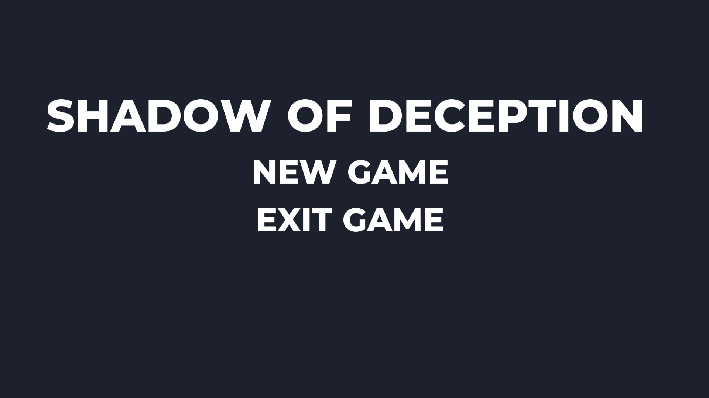

# Shadow Of Deception
Puzzle Platformer created using the Godot engine

After seeing this pixel art tileset and demo from [0x72](https://0x72.itch.io) I just knew that I wanted to recreate this in the Godot Engine. 
This game is puzzle platformer where you move around and hit mirriors, switches and fireballs to solve problems to proceed in the game.

This was my first game created using the Godot engine with GDScript which is a python-like programming language.

This was a huge learning experience and I've learned a lot creating this game in terms of programming and the Godot engine.

Things I would do differently next project:

- Create a full state machine
- Use global scripts rather then excessive over use of signals
- Name function better

The keys are:

- Arrow keys to move arround
- Z - Resets Level
- X - Attack
- C - Jump

Play at [Itch.io](https://vivaz.itch.io/shadow-of-deception) or [NEWGROUNDS](https://www.newgrounds.com/portal/view/730897)

### TECH STACK

- Godot Engine
- Aseprite

### FEATURES

- Three playable levels

### SCREENSHOTS

